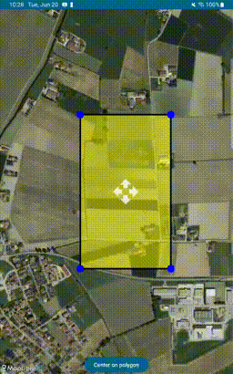
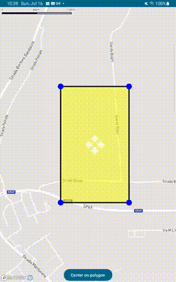
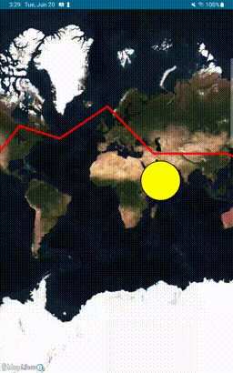
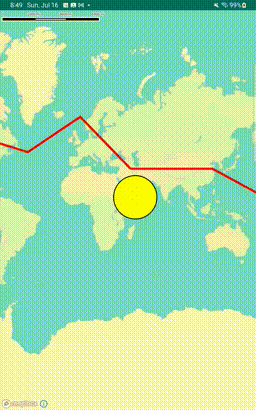

# Ramani-Maps

An Android Compose library to manipulate maps.

## What does the license say?

Ramani-Maps is licensed under the [Mozilla Public License v2.0](https://www.mozilla.org/en-US/MPL/2.0/).
A very good resource to understand it is the [MPL-2.0 FAQ](https://www.mozilla.org/en-US/MPL/2.0/FAQ/),
but the idea is this:

* If you only use the library (without modifying its source code), then you
  should just add a link to this repo somewhere in your app.
* If you modify the library (e.g. by fixing a bug), then you should make the
  changes available to your users, e.g. by maintaining a public fork, or by
  contributing the fixes to this repo.

## Quick Start with MapLibre

Add the dependency to `build.gradle`:

```gradle
implementation 'org.ramani-maps:ramani-maplibre:0.3.0'
```

Insert the map composable:

```kotlin
MapLibre(modifier = Modifier.fillMaxSize())
```

A map will now appear in your app!

If you want to do anything useful though (the free maps are not very detailed),
you'll either need a commercial tile provider or your own tile hosting.
Several tile providers offer vector tiles with support for MapLibre:

* [MapTiler](https://cloud.maptiler.com/account/keys)
* [Stadia Maps](https://client.stadiamaps.com/)

Note that most vendors require an API key in order to authenticate requests.
For MapTiler, you must add `?key=YOUR-API-KEY` at the end of the URL,
and for Stadia Maps, you must add `?api_key=YOUR-API-KEY`.
Consult your tile provider's documentation for details.

## Quick Start with Mapbox

Mapbox requires its own repository in the dependency management:

```
maven {
    url 'https://api.mapbox.com/downloads/v2/releases/maven'
    authentication {
        basic(BasicAuthentication)
    }
    credentials {
        // Do not change the username below.
        // This should always be `mapbox` (not your username).
        username = "mapbox"
        // Use the secret token you stored in gradle.properties as the password
        password = <your mapbox download token>
    }
}
```

Add the dependency to `build.gradle`:

```gradle
implementation 'org.ramani-maps:ramani-mapbox:0.1.0'
```

Insert the map composable:

```kotlin
Mapbox(modifier = Modifier.fillMaxSize(), apiKey = "<your API key here>")
```

The map will now appear in your app!

NOTE: you need a [Mapbox](https://www.mapbox.com) account (they have a free tier).

## Examples

We provide a few simple examples demonstrating some of the supported features.

### Interactive Polygon

The left image shows the example app running with `ramani-maplibre`,
while the right uses `ramani-mapbox`.




The complete application is available in [examples/interactive-polygon](./examples/interactive-polygon).
It builds with `ramani-maplibre`, but switching to `ramani-mapbox`
is easy since they both have a very similar API.

The actual code is extremely short:

```kotlin
class MainActivity : ComponentActivity() {
    override fun onCreate(savedInstanceState: Bundle?) {
        super.onCreate(savedInstanceState)
        setContent {
            InteractivePolygonTheme {
                var polygonCenter = LatLng(44.989, 10.809)
                var polygonState by rememberSaveable { mutableStateOf(polygonPoints) }
                val cameraPosition = rememberSaveable {
                    mutableStateOf(CameraPosition(target = polygonCenter, zoom = 15.0))
                }

                Box {
                    Surface(
                        modifier = Modifier.fillMaxSize(),
                        color = MaterialTheme.colorScheme.background
                    ) {
                        MapLibre(
                            modifier = Modifier.fillMaxSize(),
                            apiKey = resources.getString(apiKey = "<your API key here>"),
                            cameraPosition = cameraPosition.value
                        ) {
                            // Create a handle for each vertex (those are blue circles)
                            polygonState.forEachIndexed { index, vertex ->
                                Circle(
                                    center = vertex,
                                    radius = 10.0F,
                                    color = "Blue",
                                    zIndex = 1,
                                    isDraggable = true,
                                    onCenterDragged = { newCenter ->
                                        polygonState = polygonState.toMutableList()
                                            .apply { this[index] = newCenter }
                                    }
                                )
                            }
                            // Create the polygon
                            Polygon(
                                vertices = polygonState,
                                isDraggable = true,
                                draggerImageId = R.drawable.ic_drag,
                                borderWidth = 4.0F,
                                fillColor = "Yellow",
                                opacity = 0.5F,
                                onCenterChanged = { newCenter ->
                                    polygonCenter = newCenter
                                },
                                onVerticesChanged = { newVertices -> polygonState = newVertices },
                            )
                        }
                    }
                    // Add a button that centers the map on the polygon when clicked
                    Button(
                        modifier = Modifier.align(Alignment.BottomCenter),
                        onClick = {
                            cameraPosition.value = CameraPosition(cameraPosition.value).apply {
                                this.target = polygonCenter
                            }
                        },
                    ) {
                        Text(text = "Center on polygon")
                    }
                }
            }
        }
    }

    // Initial position of the polygon
    private val polygonPoints = listOf(
        LatLng(44.986, 10.812),
        LatLng(44.986, 10.807),
        LatLng(44.992, 10.807),
        LatLng(44.992, 10.812),
    )
}
```

### Annotation Simple

The left image shows the example app running with `ramani-maplibre`,
while the right uses `ramani-mapbox`.




The complete application is available in [examples/annotation-simple](./examples/annotation-simple).
It builds with `ramani-mapbox`, but switching to `ramani-maplibre`
is easy since they both have a very similar API.

The actual code is extremely short:

```kotlin
class MainActivity : ComponentActivity() {
    override fun onCreate(savedInstanceState: Bundle?) {
        super.onCreate(savedInstanceState)

        setContent {
            AnnotationSimpleTheme {
                val cameraPosition = rememberSaveable {
                    mutableStateOf(
                        CameraPosition(
                            target = LatLng(46.0, 4.8),
                            zoom = 2.0,
                        )
                    )
                }
                val circleCenter = rememberSaveable { mutableStateOf(LatLng(4.8, 46.0)) }

                Surface(
                    modifier = Modifier.fillMaxSize(),
                    color = MaterialTheme.colorScheme.background
                ) {
                    Mapbox(
                        modifier = Modifier.fillMaxSize(),
                        apiKey = "<your API key here>",
                        cameraPosition = cameraPosition.value,
                    ) {
                        // Create a draggable circle
                        Circle(
                            center = circleCenter.value,
                            radius = 50F,
                            isDraggable = true,
                            borderWidth = 2F,
                            onCenterDragged = { center -> circleCenter.value = center }
                        )
                        // Create a polyline
                        Polyline(points = polylinePoints, color = "Red", lineWidth = 5.0F)
                    }
                }
            }
        }
    }

    // Coordinates of the polyline
    private val polylinePoints = listOf(
        LatLng(34.9, 46.2),
        LatLng(64.0, 0.8),
        LatLng(46.2, -46.5),
        LatLng(54.1, -86.2),
        LatLng(24.9, -116.6),
        LatLng(0.0, -171.3),
        LatLng(34.9, -240.1),
        LatLng(34.9, -313.8),
    )
}
```

## Supported features

Please note that the library currently only exposes a small subset
of the underlying map functionality and so there are plenty of features
that can still be added. Obviously we started with the ones we use!

Currently supported are:

* Map properties (set min/max zoom, ...)
* Camera position (move the map, set the zoom, ...)
* Device location (show the position on the map)
* Symbols (i.e. markers made of an image or a text)
* Polylines
* Polygons
* Circles
* Fills
* External sources, layers, images (useful to import a GeoJson and render clusters)

## Contributions

Contributions are of course very welcome and we are happy to assist
getting pull requests reviewed and merged.

## What does Ramani mean?

"Ramani" means "maps" in Swahili (one of the authors grew up in Tanzania).

