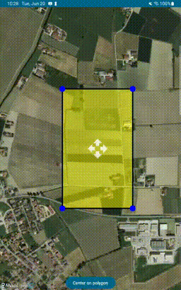
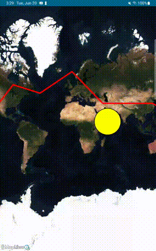

# Ramani-Maps

An Android Compose library to manipulate maps.

## What does the license say?

Ramani-Maps is licensed under the [Mozilla Public License v2.0](https://www.mozilla.org/en-US/MPL/2.0/).
A very good resource to understand it is the [MPL-2.0 FAQ](https://www.mozilla.org/en-US/MPL/2.0/FAQ/),
but the idea is this:

* If you only use the library (without modifying its source code), then you
  should just add a link to this repo somewhere in your app.
* If you modify the library (e.g. by fixing a bug), then you should make the
  changes available to your users, e.g. by maintaining a public fork, or by
  contributing the fixes to this repo.

## Quick Start with MapLibre

Add the dependency to `build.gradle`:

```gradle
implementation 'org.ramani-maps:ramani-maplibre:0.10.0'
```

Insert the map composable:

```kotlin
MapLibre(modifier = Modifier.fillMaxSize())
```

A map will now appear in your app!

If you want to do anything useful though (the free maps are not very detailed),
you'll either need a commercial tile provider, a free tile provider, or your own tile hosting.
Several tile providers offer vector tiles with support for MapLibre:

* [MapTiler](https://cloud.maptiler.com/account/keys)
* [Stadia Maps](https://client.stadiamaps.com/)
* [OpenFreeMap](https://openfreemap.org)

Note that most vendors require an API key in order to authenticate requests.
For MapTiler, you must add `?key=YOUR-API-KEY` at the end of the URL,
and for Stadia Maps, you must add `?api_key=YOUR-API-KEY`.
Consult your tile provider's documentation for details; OpenFreeMap does not
require an API key.

## Quick Start with OpenFreeMap

[OpenFreeMap](https://openfreemap.org) provides completely free map tiles based on [OpenStreetMap](https://openstreetmap.org) data. There are no usage limits and no registration or API key is needed. One important caveat with OpenFreeMap is that if you are using MapLibre Native 11.8.0+ (and by extension, Ramani 0.9.0+) on an *Android emulator* you must use Vulkan as a back end, as otherwise, text and symbols will not be rendered correctly. Please see [the documentation on using Vulkan](README.vulkan.md).

The style URLs to use are documented [on OpenFreeMap](https://openfreemap.org/quick_start).

## Examples

We provide a few simple examples demonstrating some of the supported features.

### Interactive Polygon



### Annotation Simple



## Supported features

* Map properties (set min/max zoom, ...)
* Camera position (move the map, set the zoom, ...)
* Device location (show the position on the map)
* Symbols (i.e. markers made of an image or a text)
* Polylines
* Polygons
* Circles
* Fills
* External sources, layers, images (useful to import a GeoJson and render clusters)

## Contributions

Contributions are of course very welcome and we are happy to assist
getting pull requests reviewed and merged.

## What does Ramani mean?

"Ramani" means "maps" in Swahili (one of the authors grew up in Tanzania).

